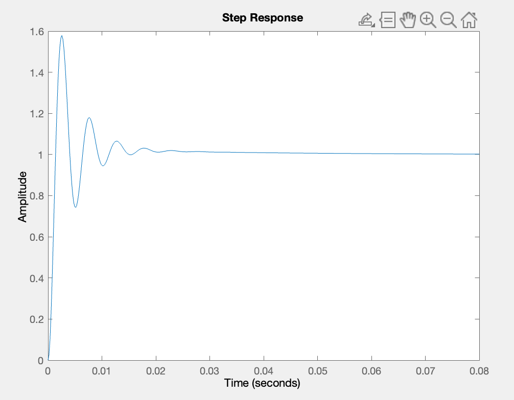
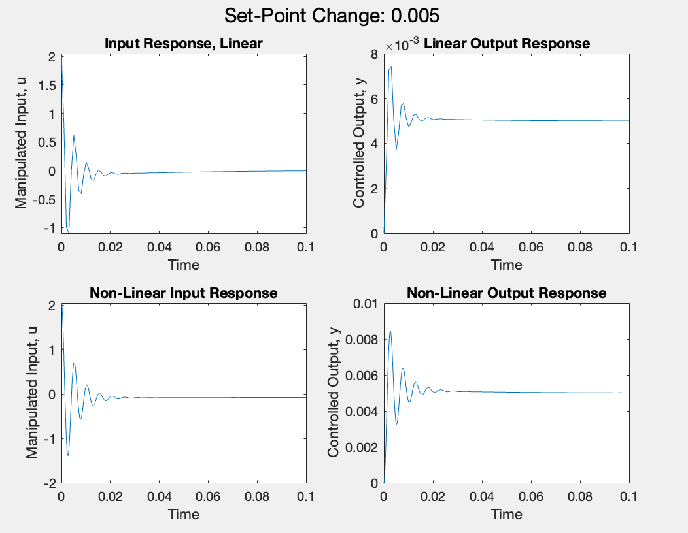
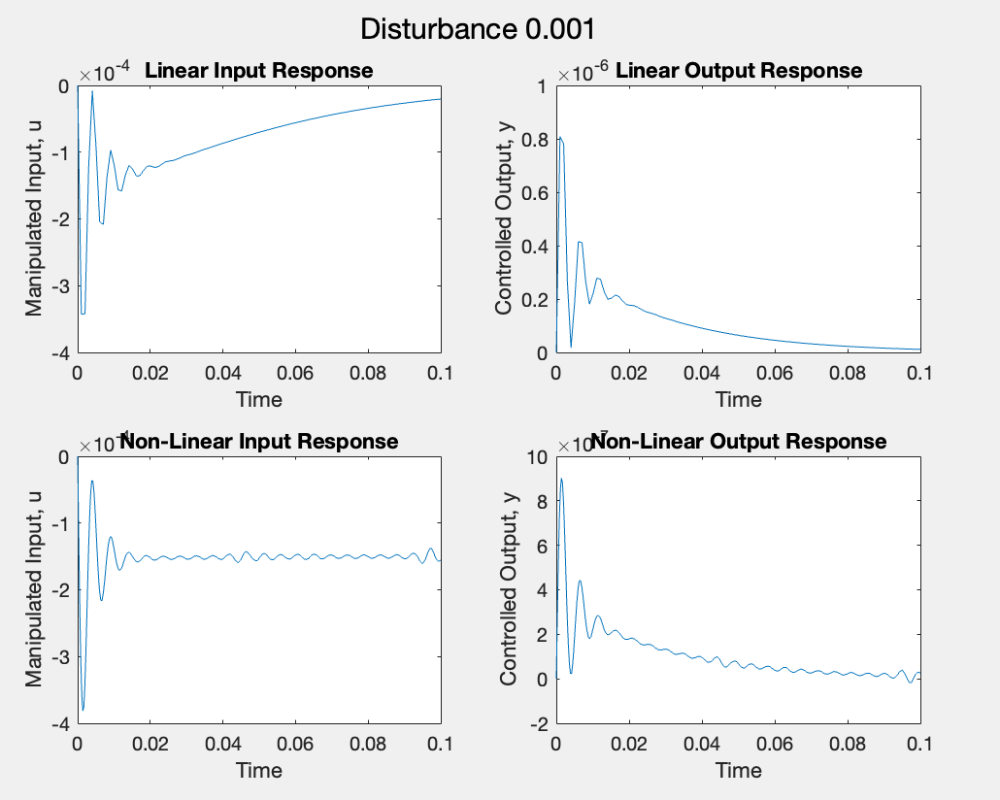

# PID-Process-Control-and-Dynamics
Simulation of PID controllers and control of dynamic systems using feedback control algorithms 

# MATLAB Plots

CSTR Reactor Schematic 

 

Step Response 

 

Nonlinear System Responses 

 

Disturbance Responses 

 
