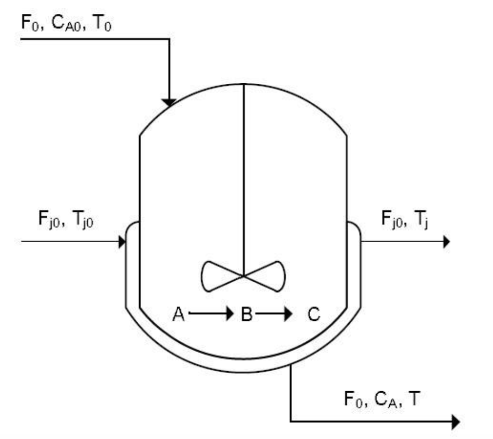

# PID-Process-Control-and-Dynamics
Simulation of PID controllers and control of dynamic systems using feedback control algorithms 

Paper: [PID Process Control of CSTR](https://drive.google.com/file/d/1Aj3QC3TXND7bN2MleaXrS2jbhktPbEiD/view?usp=sharing)
 

# MATLAB Plots

CSTR Reactor Schematic 

 

Step Response 

 

Nonlinear System Responses 

 

Disturbance Responses 

 
